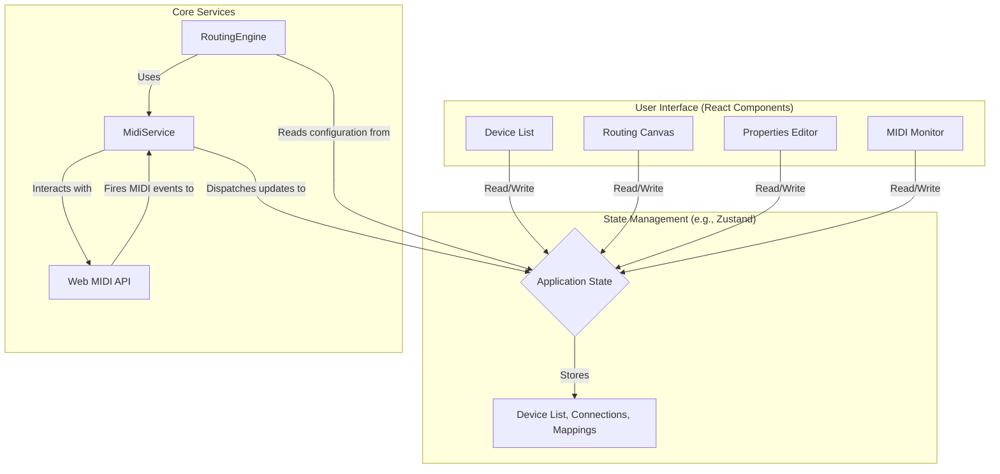

# Software Architecture

This document outlines the software architecture for the MIDI Router Web Application using a Mermaid diagram.

## Architecture Components

*   **User Interface (React Components):**
    *   **Device List:** Displays available MIDI devices.
    *   **Routing Canvas:** The main visual workspace for connecting device nodes.
    *   **Properties Editor:** A panel or modal to edit the properties of a connection (filters, mappings).
    *   **MIDI Monitor:** A component to display real-time MIDI message logs.

*   **State Management (e.g., Zustand):**
    *   A centralized store holding the entire application state, including the list of devices, their connections, and any filtering or mapping rules. The UI is a reactive representation of this state.

*   **Core Services:**
    *   **MidiService:** A singleton service that encapsulates all communication with the browser's Web MIDI API. It is responsible for detecting devices and handling raw MIDI input/output.
    *   **RoutingEngine:** The brain of the application. It listens for changes in the application state (like new connections) and processes incoming MIDI messages from the `MidiService` according to the routing, filtering, and mapping rules defined in the state.

## Recommended Toolchain

To ensure consistency, simplify development, and leverage a modern ecosystem, the project should adhere to the following set of libraries. This curated toolchain provides a robust foundation for all the required features.

*   **Frontend Framework:** **React** with **Vite**
    *   **Reasoning:** React is a mature and powerful library for building complex user interfaces. Paired with Vite, it provides a fast development server and an optimized build process.

*   **State Management:** **Zustand**
    *   **Reasoning:** A lightweight and simple state management library that uses a modern, hook-based API. It is less complex than Redux and is well-suited for the application's scope.

*   **UI Components:** **MUI (Material-UI)**
    *   **Reasoning:** MUI offers a comprehensive library of accessible, touch-friendly components that can be easily themed for the required high-contrast/dark mode. This aligns with the core UI/UX guidelines.

*   **Visual Routing Canvas:** **React Flow**
    *   **Reasoning:** This library is purpose-built for creating node-based editors. It provides the core functionality for the routing canvas, including draggable nodes, customizable connections (cables), and event handling.

*   **Styling:** **Emotion**
    *   **Reasoning:** As the default styling engine for MUI, using Emotion directly for custom components ensures a consistent styling approach and allows easy access to the theme variables defined for the application.
