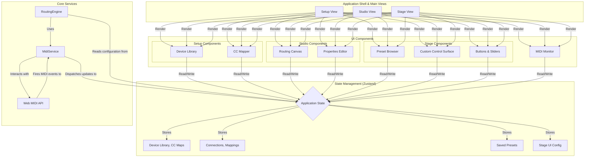

# Software Architecture

This document outlines the software architecture for the MIDI Router Web Application, designed around three core user perspectives: Setup, Studio, and Stage.

## Architecture Components

*   **Main Views:** The application is split into three main views, each corresponding to a specific workflow.
    *   **Setup View:** Manages the device library and their MIDI CC definitions.
    *   **Studio View:** The primary workspace for visual routing and MIDI processing.
    *   **Stage View:** A simplified interface for live performance with custom controls.

*   **UI Components:**
    *   **Setup:** `Device Library` for managing instrument definitions and a `CC Mapper` for naming CC messages.
    *   **Studio:** The `Routing Canvas` (using React Flow) for visual connections and a `Properties Editor` for filters/mappings.
    *   **Stage:** A `Preset Browser` for loading setups and a `Custom Control Surface` populated with interactive `Buttons & Sliders`.
    *   **Shared:** A `MIDI Monitor` is available for debugging across relevant views.

*   **State Management (Zustand):**
    *   A single, centralized store holds the entire application state, which is now organized to reflect the new features: the `Device Library`, routing `Connections`, saved `Presets`, and `Stage UI` configurations.

*   **Core Services:**
    *   **MidiService:** Encapsulates all communication with the Web MIDI API.
    *   **RoutingEngine:** Processes incoming MIDI messages based on the active preset's routing, filtering, and mapping rules. It also processes UI events from the Stage view to generate outgoing MIDI.

## Recommended Toolchain

To ensure consistency, simplify development, and leverage a modern ecosystem, the project should adhere to the following set of libraries. This curated toolchain provides a robust foundation for all the required features.

*   **Frontend Framework:** **React** with **Vite**
    *   **Reasoning:** React is a mature and powerful library for building complex user interfaces. Paired with Vite, it provides a fast development server and an optimized build process.

*   **State Management:** **Zustand**
    *   **Reasoning:** A lightweight and simple state management library that uses a modern, hook-based API. It is less complex than Redux and is well-suited for the application's scope.

*   **UI Components:** **MUI (Material-UI)**
    *   **Reasoning:** MUI offers a comprehensive library of accessible, touch-friendly components that can be easily themed for the required high-contrast/dark mode. This aligns with the core UI/UX guidelines.

*   **Visual Routing Canvas:** **React Flow**
    *   **Reasoning:** This library is purpose-built for creating node-based editors. It provides the core functionality for the routing canvas, including draggable nodes, customizable connections (cables), and event handling.

*   **Styling:** **Emotion**
    *   **Reasoning:** As the default styling engine for MUI, using Emotion directly for custom components ensures a consistent styling approach and allows easy access to the theme variables defined for the application.